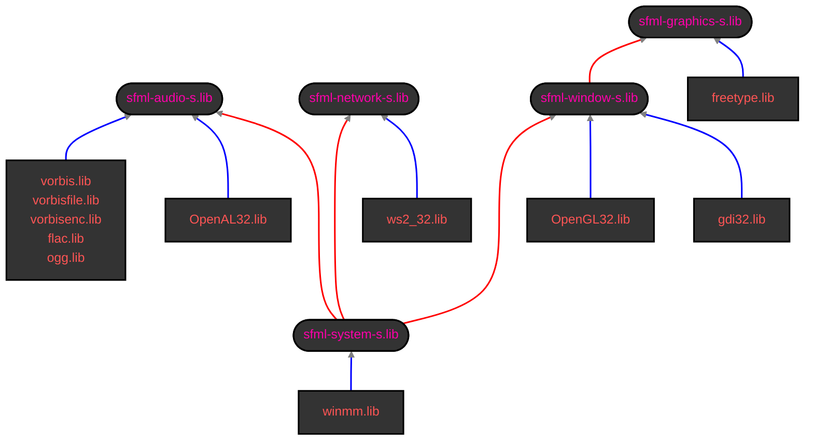

# SFML configuration set for Visual Studio projects
***
`Configuration Properties` → `C/C++` → `General` → `[ Additional Include Directories ]`
```
C:\a-directory-with-the-SFML-headers-directory\;
```
---
`Configuration Properties` → `C/C++` → `Proprocessor` → `[ Proprocessor Definition ]`
```
SFML_STATIC;
```
| Dynamic linking | Static linking |
|:-:|:-:|
| |`SFML_STATIC`|
---
`Configuration Properties` → `C/C++` → `Code Generatio` → `[ Runtime Library ]`
```
Multi-threaded (/MT)
```
| Dynamic linking (Debug) | Dynamic linking (Release) | Static linking (Debug) | Static linking (Release) |
|:-:|:-:|:-:|:-:|
|`Multi-threaded Debug DLL (/MDd)`|`Multi-threaded DLL (/MD)`|`Multi-threaded Debug (/MTd)`|`Multi-threaded (/MT)`|
---
`Configuration Properties` → `Linker` → `General` → `[ Additional Library Directories ]`
```
C:\a-directory-with-lib-type-files\;
```
---
`Configuration Properties` → `Linker` → `Input` → `[ Additional Dependencies ]`
```
sfml-main.lib
sfml-graphics-s.lib
freetype.lib
sfml-window-s.lib
gdi32.lib
OpenGL32.lib
sfml-network-s.lib
ws2_32.lib
sfml-audio-s.lib
vorbis.lib
vorbisfile.lib
vorbisenc.lib
flac.lib
ogg.lib
OpenAL32.lib
sfml-system-s.lib
winmm.lib
```
| Dynamic linking (Debug) | Dynamic linking (Release) | Static linking (Debug) | Static linking (Release) |
|:-|:-|:-|:-|
|`sfml-main-d.lib`<br>`sfml-graphics-d.lib`<br>`sfml-window-d.lib`<br>`sfml-network-d.lib`<br>`sfml-audio-d.lib`<br>`sfml-system-d.lib`|`sfml-main.lib`<br>`sfml-graphics.lib`<br>`sfml-window.lib`<br>`sfml-network.lib`<br>`sfml-audio.lib`<br>`sfml-system.lib`|`sfml-main-d.lib`<br>`sfml-graphics-s-d.lib`<br>`freetype.lib`<br>`sfml-window-s-d.lib`<br>`gdi32.lib`<br>`OpenGL32.lib`<br>`sfml-network-s-d.lib`<br>`ws2_32.lib`<br>`sfml-audio-s-d.lib`<br>`vorbis.lib`<br>`vorbisfile.lib`<br>`vorbisenc.lib`<br>`flac.lib`<br>`ogg.lib`<br>`OpenAL32.lib`<br>`sfml-system-s-d.lib`<br>`winmm.lib`|`sfml-main.lib`<br>`sfml-graphics-s.lib`<br>`freetype.lib`<br>`sfml-window-s.lib`<br>`gdi32.lib`<br>`OpenGL32.lib`<br>`sfml-network-s.lib`<br>`ws2_32.lib`<br>`sfml-audio-s.lib`<br>`vorbis.lib`<br>`vorbisfile.lib`<br>`vorbisenc.lib`<br>`flac.lib`<br>`ogg.lib`<br>`OpenAL32.lib`<br>`sfml-system-s.lib`<br>`winmm.lib`|

## SFML libraries dependencies scheme for static linking


---
`Configuration Properties` → `Linker` → `System` → `[ SubSystem ]`
```
Windows (/SUBSYSTEM:WINDOWS)
```
| Debug | Release |
|:-:|:-:|
|`Console (/SUBSYSTEM:CONSOLE)`|`Windows (/SUBSYSTEM:WINDOWS)`|
